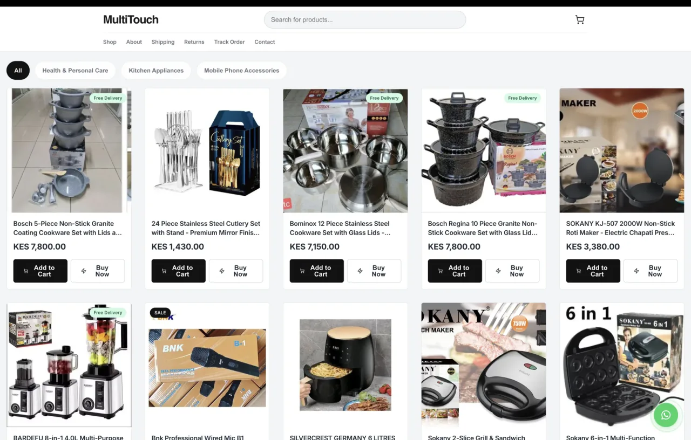
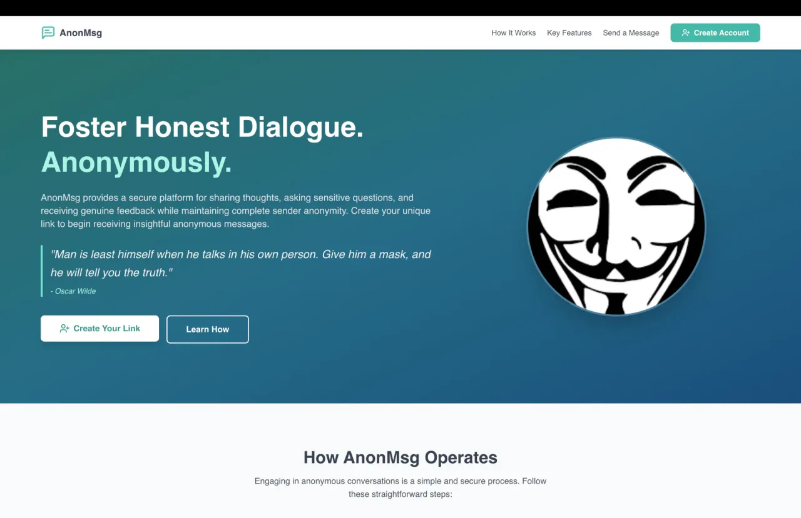

# Fredrick Maina

### I build backend and AI systems people use.

Backend engineering · Applied AI · Nairobi, Kenya

[Portfolio](https://www.fredmaina.com/) · [LinkedIn](https://www.linkedin.com/in/fredmaina) · [Email](mailto:hi@fredmaina.com) · [View my CV](https://drive.google.com/file/d/1Yy56Z6vgilDL0XFAA2WKgAEzSEhGpYk9/view?usp=sharing)

---

I take products from an early idea to production: APIs, data flows, retrieval systems, cloud infrastructure, and the safeguards that keep them dependable.

At **Dalberg Data Insights**, I work as a Junior Data Scientist focused on backend engineering and applied AI. My work spans multilingual assistants, retrieval pipelines, and production infrastructure. I enjoy turning an ambiguous problem into software that is useful, testable, and observable.

## Selected work

### MultiTouch · Commerce, from checkout to operations

A live Kenyan commerce platform I designed and built as the **sole engineer**, covering the storefront, administration, payments, delivery, identity, and deployment.

- **Reliable orders:** transactional stock reservation, idempotent placement, and recovery for abandoned orders.
- **M-Pesa payments:** STK Push, callback deduplication, polling fallback, and balance reconciliation.
- **Production operations:** transactional outbox, audit logs, Prometheus metrics, and releases with health checks and automatic rollback.

**Java 21 · Spring Boot · PostgreSQL · AWS · Kubernetes**

[Explore MultiTouch →](https://shopmultitouch.com)

### AnonMsg · Real-time conversations

A messaging application connecting authenticated accounts with anonymous visitors. WebSockets power live conversations, Redis Pub/Sub carries messages across instances, and Google OAuth2 and JWT handle identity. Deployment is automated on Google Kubernetes Engine.

**Spring Boot · Next.js · Redis · WebSockets · GKE**

[Explore AnonMsg →](https://anonmsg.fredmaina.com)

## Experience that shapes my work

| Team | Contribution |
| --- | --- |
| **Dalberg Data Insights** · Junior Data Scientist | Led development of a multilingual Amazon Bedrock assistant. Built retrieval and safety pipelines for a three-language financial-coaching pilot used by roughly 200 people. Implemented infrastructure changes projected to reduce monthly AWS costs by approximately 50%. |
| **Twiga Foods** · Software Engineering Intern | Built Java and Python services for warehouse operations, shipped REST and GraphQL services to GKE, and contributed to centralized authentication and a Java 21 migration. |
| **Power Learn Project** · Database Instructor | Taught MySQL and data analysis in a programme serving more than 8,000 learners. |

## My toolkit

| Area | Tools |
| --- | --- |
| Backend | Java, Spring Boot, Python, FastAPI |
| Data & messaging | PostgreSQL, Redis, WebSockets |
| Applied AI | Amazon Bedrock, OpenAI Responses API, retrieval pipelines |
| Infrastructure | AWS, GCP, Docker, Kubernetes, GitHub Actions |

Mathematics and Computer Science at **Kenyatta University** · **AWS Certified Cloud Practitioner**, 2024

---

## Let’s build something useful

Have a backend challenge, an AI product idea, or an opportunity where I could contribute? I’d like to hear about it.

**[Get in touch](mailto:hi@fredmaina.com)** · **[Book a coffee chat](https://www.fredmaina.com/#coffee)** · **[See my portfolio](https://www.fredmaina.com/)**
